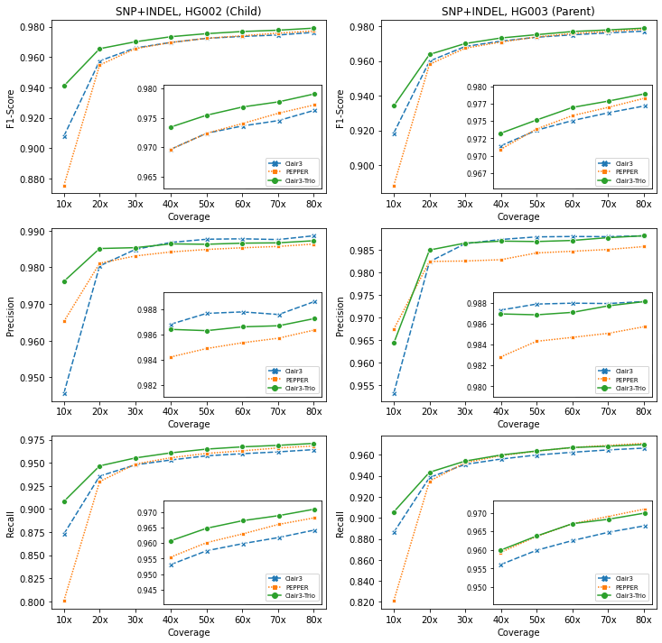

# Guppy5 model (under develop)

You can use the Guppy5 model `c3t_hg002_r941_prom_sup_g5014` for Guppy6 data.


## Contents

* [About `c3t_hg002_r941_prom_sup_g5014`](#c3t-hg002-r941-prom-sup-g5014)
* [How to use the Guppy5 model](#how-to-use-the-guppy5-model)
* [Guppy5 data used for training and testing](#guppy5-data-used-for-training-and-testing)

---

## About `c3t_hg002_r941_prom_sup_g5014`

The Guppy5 data are trained on data same as in [Clair3](https://github.com/HKU-BAL/Clair3/blob/main/docs/guppy5_20220113.md) (basecalled three GIAB samples (HG002, 3, 4) with fast5 available from the Human Pangenome Reference Consortium (HPRC) using Guppy5 and the dna_r9.4.1_450bps_sup mode).

We trained the model while holding out chromosome 20 in training stages and preserving it for testing.

We compared the new Guppy5 trained gainst [Clair3 v0.1-r11, r941_prom_sup_g5014](https://github.com/HKU-BAL/Clair3) and [PEPPER r0.8, ont_r9_guppy5_sup](https://github.com/kishwarshafin/pepper). 

<!--  -->


<!--  -->


Detailed results are in [this table](./guppy5_table.md).

---

## How to use the Guppy5 model

```
INPUT_DIR="[YOUR_INPUT_FOLDER]"            # e.g. /input
REF=${_INPUT_DIR}/ref.fa                   # change your reference file name here
OUTPUT_DIR="[YOUR_OUTPUT_FOLDER]"          # e.g. /output
THREADS="[MAXIMUM_THREADS]"                # e.g. 8
MODEL_C3="r941_prom_sup_g5014"         	   # Guppy5 Clair3 model
MODEL_C3T="c3t_hg002_r941_prom_sup_g5014"  # Guppy5 Clair3-Trio model


docker run -it \
  -v ${INPUT_DIR}:${INPUT_DIR} \
  -v ${OUTPUT_DIR}:${OUTPUT_DIR} \
  hkubal/clair3-trio:latest \
  /opt/bin/run_clair3_trio.sh \
  --ref_fn=${INPUT_DIR}/ref.fa \                  ## change your reference file name here
  --bam_fn_c=${INPUT_DIR}/child_input.bam \       ## change your child's bam file name here 
  --bam_fn_p1=${INPUT_DIR}/parent1_input.bam \    ## change your parnet-1's bam file name here     
  --bam_fn_p2=${INPUT_DIR}/parenet2_input.bam \   ## change your parnet-2's bam file name here   
  --sample_name_c=${SAMPLE_C} \                   ## change your child's name here
  --sample_name_p1=${SAMPLE_P1} \                 ## change your parnet-1's name here
  --sample_name_p2=${SAMPLE_P2} \                 ## change your parent-2's name here
  --threads=${THREADS} \                          ## maximum threads to be used
  --model_path_clair3="/opt/models/clair3_models/${MODEL_C3}" \
  --model_path_clair3_trio="/opt/models/clair3_trio_models/${MODEL_C3T}" \
  --output=${OUTPUT_DIR}                          ## absolute output path prefix 
```

Check [Usage](https://github.com/HKU-BAL/Clair3-Trio#Usage) for more options.


## Guppy5 data used for training and testing

### FASTQs
[http://www.bio8.cs.hku.hk/guppy5_data/](http://www.bio8.cs.hku.hk/guppy5_data/)

### FAST5s
| Sample |   Reference   | Aligner  | Coverage |                   Basecaller                   |                              link                             |
| :----: | :-----------: | :------: | :------: | :--------------------------------------------: | :----------------------------------------------------------: |
| HG002  | GRCh38_no_alt | minimap2 |  117.4   | Guppy v5.0.14 (dna_r9.4.1_450bps_sup_prom.cfg) | [link](https://s3-us-west-2.amazonaws.com/human-pangenomics/index.html?prefix=NHGRI_UCSC_panel/HG002/nanopore/) |
| HG003  | GRCh38_no_alt | minimap2 |   78.9   | Guppy v5.0.14 (dna_r9.4.1_450bps_hac_prom.cfg) | [link](https://s3-us-west-2.amazonaws.com/human-pangenomics/index.html?prefix=NHGRI_UCSC_panel/HG003/nanopore/) |
| HG004  | GRCh38_no_alt | minimap2 |   79.0   | Guppy v5.0.14 (dna_r9.4.1_450bps_sup_prom.cfg) | [link](https://s3-us-west-2.amazonaws.com/human-pangenomics/index.html?prefix=NHGRI_UCSC_panel/HG004/nanopore/) |

We trained the model while holding out chromosome 20 in training stages and preserving it for testing.

